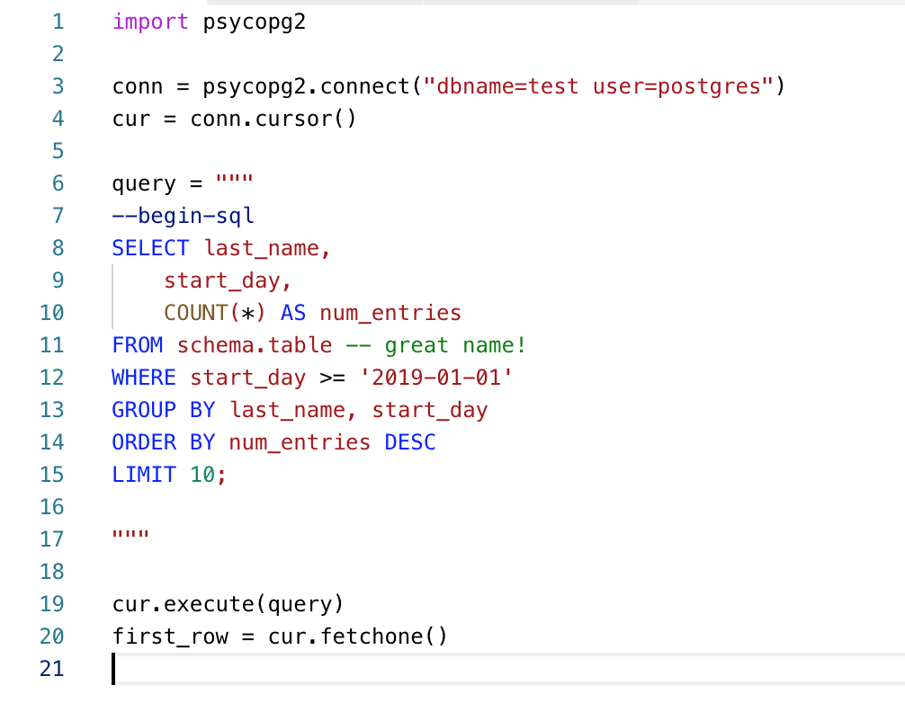

# Python String HTML 
> Hopefully ready to add to the VSCode Marketplace soon

Adds syntax highlight support for code, placed in python multiline SQL strings

## Community
- 2018-09-04 forked from [es6-string-css](https://github.com/bashmish/es6-string-css) - Highlight CSS in ES6 template literals

## Installation

- Install `python-string-sql` from extensions (`ctrl + shift + x`)

## Example

## Usage

Simply insert `--sql`, `--beginsql`, or `--begin-sql` at the beginning of the string
and `--endsql` or `--end-sql` at the end of the string

## Requirements

- Visual Studio Code v1.32.0 recommended
- Comment `--sql` to start highlighting in the string. Possible values:

## Donation

If this project help you reduce time to develop, you can give the original develper a cup of coffee :)

## Release Notes

### [0.0.1] - 2018-09-04
- Got it working based on [these instructions](https://code.visualstudio.com/api/language-extensions/syntax-highlight-guide)

### [0.0.0] - 2018-09-04
- Forked from es6-string-html

-----------------------------------------------------------------------------------------------------------

**Enjoy!**
