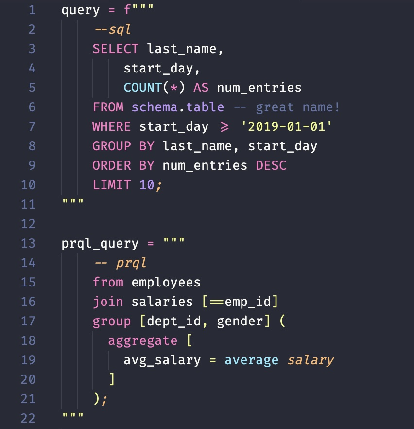

# Highlighting Inline SQL & PRQL for VS Code 

Syntax Highlighting for SQL and [PRQL](https://prql-lang.org/) in JS template literals in .js/.jsx/.ts/.tsx, Go template literals, Python multi-qutoted/f-strings.

## Acknowledgements

I would like to thank the following projects, which were instrumental in the development of this project:

- [ptweir/python-string-sql](https://github.com/ptweir/python-string-sql)

Thank you to the maintainers and contributors of these projects!

## Requirements

- For PRQL highlighting, you need to install the [PRQL](https://marketplace.visualstudio.com/items?itemName=PRQL-lang.prql-vscode) extension first

## Installation

Install `Highlight Inline SQL` from the Extensions Marketplace (`ctrl + shift + x` or `cmd + shift + x` on mac).
> Also available on [marketplace.visualstudio.com](https://marketplace.visualstudio.com/items?itemName=yicone.highlight-inline-sql)

## Example




## Usage

Insert `--sql`, `--beginsql`, or `--begin-sql` at the beginning of the part of the string you would like highlighted and a semicolon, `--endsql`, or `--end-sql` at the end of the highlighted section.

For PRQL, Insert `--prql`, `--beginprql`, or `--begin-prql` at the beginning of the part of the string you would like highlighted and a semicolon, `--endprql`, or `--end-prql` at the end of the highlighted section.

### Snippets
begin typing `sql` and the autocomplete snippet will appear:


There was `prql` for PRQL also.

### Keybindings

ctrl+k s (or cmd+k s on macOS) - Insert the following snippet:
```
"""
--sql
SELECT
;
"""
```

For PRQL, the keybinding is: ctrl+k p (or cmd+k p on macOS)


